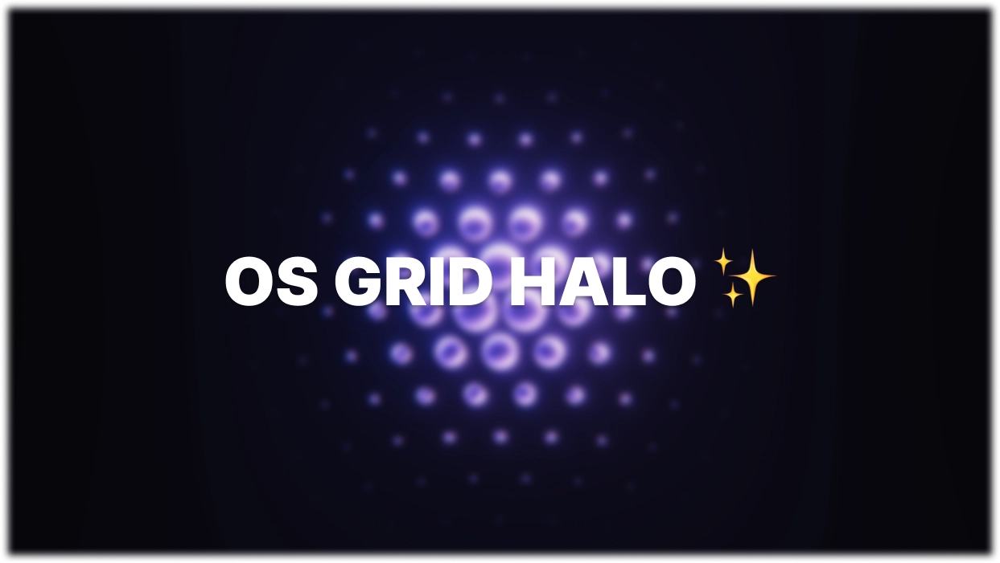

An experimental grid-based halo effect built with the [TresJS](https://tresjs.org/) ecosystem. <br> <br>
👉 [Live Demo](https://os-grid-halo.netlify.app/)

## 🌀 Technique

This demo creates a **hexagonal grid of instanced spheres** using `InstancedMesh` from Three.js.
Each sphere reacts dynamically to the cursor position:

- **Parallax & falloff scaling**:
  Instances closer to the cursor grow in size with a smooth falloff (`exp(-x²)`).

- **Custom Fresnel shader**:
  A `three-custom-shader-material` fragment shader blends a **base color** with a **fresnel rim highlight**.
  The rim is anisotropic (elliptical) and modulated with procedural **noise (fbm)** for an organic look.

- **Performance**:
  - `DynamicDrawUsage` + `setMatrixAt` for efficient updates.
  - Uses GSAP’s `quickTo` for smooth mouse-driven parallax offsets.
  - Fully GPU instanced, allowing thousands of animated spheres.

The result is a **halo-like shimmering grid** that follows the mouse and reacts with fresnel-driven highlights.

## 🛠️ Stack

- [Nuxt 3](https://nuxt.com/)
- [TresJS](https://tresjs.org/)
- [GSAP](https://greensock.com/gsap/)
- [VueUse](https://vueuse.org/)
- [THREE-CustomShaderMaterial](https://github.com/FarazzShaikh/THREE-CustomShaderMaterial)

## Setup

Make sure to install dependencies:

```bash
# npm
npm install
```

## Development Server

Start the development server on `http://localhost:3000`:

```bash
# npm
npm run dev
```

## Production

Build the application for production:

```bash
# npm
npm run build
```

## Generate

Generate the application for production:

```bash
# npm
npm run generate
```
